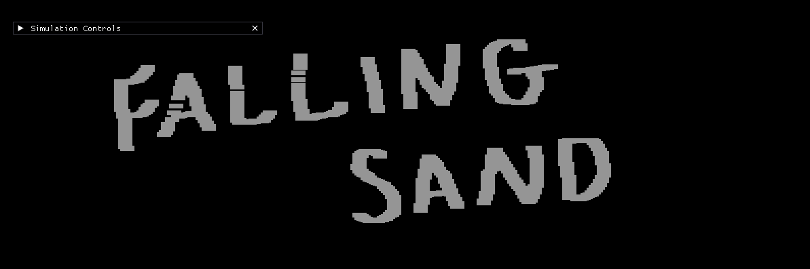

# Falling Sand Simulation

*"From ashes to dust, from CPU to GPU"*

A falling sand cellular automata simulation built with C++ and OpenGL. Experiment with different particle types, watch
them interact with physics-based rules, and paint your own pixel art sandbox.

I've always been interested in falling sand simulations, but [Noita](https://noitagame.com/) finally inspired me to make
one.

## Branches

This project contains two implementations, each with its own strengths:

### 🖥️ [CPU Branch](https://github.com/flykiller13/ron-falling-sand/tree/cpu)

The original implementation that runs entirely on the CPU. Perfect for understanding the core simulation logic and
experimenting with new particle types.

- **Performance**: Runs **1000x1000 grids** at 60 fps
- **Features**:
    - Simple, intuitive codebase
    - Easy to implement new rules and particle types
    - Supports random direction selection for natural-looking behavior

### 🚀 [GPU Branch](https://github.com/flykiller13/ron-falling-sand/tree/gpu)

A high-performance GPU-accelerated version using OpenGL compute shaders. Leverages your GPU's parallel processing power
for massive simulations.

- **Performance**: Runs **2560x1440 grids** (3,686,400 cells!) at 60 fps
- **Features**:
    - Massive performance boost
    - Handles huge simulations smoothly
    - Direct GPU rendering pipeline
    - Uses unintuitive "pull method" to avoid race conditions

#### Both branches support:

- **Sand** - Falls down and spreads to the sides
- **Water** - Flows horizontally when it can't fall
- **Stone** - Static walls and structures
- **Gas** - Rises up and spreads horizontally
- Interactive brush tool with adjustable size

## Quick Start

Choose a branch above and follow its installation instructions. Both require:

- C++20 compatible compiler
- OpenGL 4.3+
- GLFW3
- CMake 3.28+

See the individual branch READMEs for detailed setup instructions.

## Tech Stack

- **C++20** - Core language
- **OpenGL 4.3** - Graphics API
- **GLFW** - Window management and input
- **ImGui** - User Interface
- **GLAD** - OpenGL loader
- **CMake** - Build system

## Inspiration

This project was heavily inspired by [Noita](https://noitagame.com/), a physics-based action game with incredible
particle simulation. The [GDC talk on Noita's simulation](https://www.youtube.com/watch?v=prXuyMCgbTc) was particularly
influential in understanding optimization techniques like dirty rects and multithreading.

## Tested On

- **OS**: Windows 11
- **CPU**: AMD Ryzen 9 7900X 12-core
- **GPU**: NVIDIA GeForce RTX 4070 SUPER
- **RAM**: 64 GB

