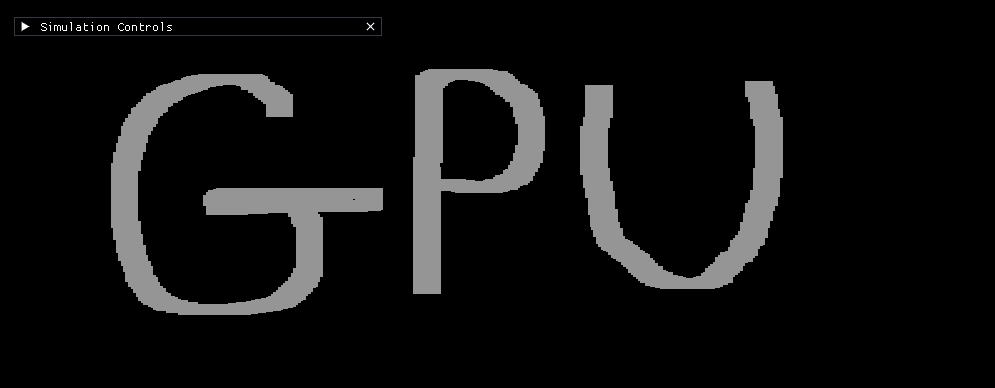

# Falling Sand Simulation



*"From ashes to dust, from CPU to GPU"*

A high-performance GPU-accelerated falling sand simulation built with OpenGL compute shaders.

I've always been interested in falling sand simulations, but [Noita](https://noitagame.com/) finally inspired me to make
one.

> **Note**: This is the GPU branch. For the CPU version check out
> the [CPU branch](https://github.com/flykiller13/ron-falling-sand/tree/cpu).

## Performance Journey

At first, I used **OpenGL to draw a texture quad** and ran the simulation on the **CPU**. Every tick, I updated each
pixel of the texture according to the simulation. This managed to run a grid of **800x800 at 60 fps**, which is okay but
I wanted more.

One solution, which is showcased in [Noita's GDC talk](https://www.youtube.com/watch?v=prXuyMCgbTc), describes using *
*dirty rects** to update only areas of the simulation that might need updating, thus skipping large static areas. I
might add this in the future.

I was more interested in **multithreading** and noticed that my strong GPU was sitting fairly idle during the
simulation, so I decided to take advantage of it. I contemplated between **CUDA** (since I'm using an NVIDIA GPU) and *
*compute shaders** and decided to go for **compute shaders for portability**.

## The Challenge: Race Conditions

Multithreading posed a big problem of **race conditions** since cellular automata rely heavily on rules and their order
of execution. The normal "scatter" method - where if a particle wants to move it checks `down → down-left → down-right`
and if it finds a suitable spot it just swaps - didn't work anymore since multiple threads could write to the same cell.

I've seen other simulations use `atomic` operations to solve this, but that completely defeats the purpose of GPU
acceleration. Atomics serialize memory access, creating bottlenecks that essentially force threads to wait in line. With
millions of cells potentially needing atomic operations every tick, you end up losing most of the parallelism benefits
that make GPU computing worthwhile. The whole point was to leverage the GPU's massive parallel processing power, not to
serialize it with locks.

## The Solution: Pull Method

The solution was to change to a **"pull" method**. Each thread is responsible for writing only to its own cell, thus
eliminating race conditions. Powders and liquids check if they should vacate (turn to empty) based on the cells around
them. Empty cells check which cells they should pull into themselves.

```glsl
// Empty cells pull particles into them
case EMPTY:
nextType = getIncomingType(pos);
break;

// Other cell types decide if they should vacate
case SAND:
if (shouldMoveOutPowder(pos)) nextType = EMPTY;
break;
```

This 180° turnaround requires more work:

1. Rules are written backwards, which is unintuitive
2. Rules must be written twice (vacate and pull), and must be symmetric

## Checkerboard Pattern

We also do **2 passes** on the compute shader in a **checkerboard pattern**. This prevents adjacent cells from being
processed simultaneously, which could cause conflicts even with the pull method. On the first pass, we process cells
where `(x + y) % 2 == 0` (even workgroups), and on the second pass, we process the odd workgroups. This ensures no two
neighboring cells read/write at the same time.

```cpp
// Pass 1: Process even workgroups
compute_shader->set_int("pass", 0);
glDispatchCompute(num_groups_x, num_groups_y, 1);
glMemoryBarrier(GL_SHADER_STORAGE_BARRIER_BIT);

// Pass 2: Process odd workgroups
compute_shader->set_int("pass", 1);
glDispatchCompute(num_groups_x, num_groups_y, 1);
glMemoryBarrier(GL_SHADER_STORAGE_BARRIER_BIT);
```

## Results

With all of this work, we managed to move the entire simulation to the GPU, also passing the colors straight to the
fragment shader. The simulation can run a **2560x1440 grid** (a whopping **3,686,400 cells!**) at **60 fps**.

A CPU-side simulation can be used later for different reasons, mainly **debugging**. It shouldn't be updated often.

### Tested On

- **OS**: Windows 11
- **CPU**: AMD Ryzen 9 7900X 12-core
- **GPU**: NVIDIA GeForce RTX 4070 SUPER
- **RAM**: 64 GB

### Note on Velocity/Acceleration

I've seen other simulations do velocity/acceleration for particles. It might be something to try in the future, but I
think it's too hard to do with the pull method.

## Tech Stack

- **C++20** - Core language
- **OpenGL 4.3** - Graphics API (compute shaders, SSBOs, Texture Quad)
- **GLFW** - Window management and input
- **ImGui** - User Interface
- **GLAD** - OpenGL loader
- **CMake** - Build system

## Installation

### Prerequisites

- **CMake** 3.28 or higher
- **C++20** compatible compiler (GCC, Clang, or MSVC)
- **OpenGL 4.3** compatible graphics driver
- **GLFW3** development libraries
- **pkg-config** (for finding GLFW)

### Linux

```bash
# Install dependencies (Ubuntu/Debian)
sudo apt-get install libglfw3-dev pkg-config

# Build
mkdir build && cd build
cmake ..
make

# Run
./FallingSand
```

### Windows (MSVC)

```bash
# Install GLFW manually or via vcpkg
# Then build:
mkdir build && cd build
cmake .. -G "Visual Studio 17 2022"
cmake --build . --config Release

# Run
Release\FallingSand.exe
```

### macOS

```bash
# Install dependencies via Homebrew
brew install glfw pkg-config

# Build
mkdir build && cd build
cmake ..
make

# Run
./FallingSand
```

## Project Structure

```
FallingSand/
├── include/
│   └── FallingSand/
│       ├── app.h              # Main application class
│       ├── input.h            # Input handling (mouse/keyboard)
│       ├── ui.h               # ImGui interface
│       ├── renderer/
│       │   ├── renderer.h     # OpenGL rendering
│       │   └── shader.h       # Shader compilation
│       └── simulation/
│           ├── simulation.h   # GPU simulation orchestration
│           └── grid.h         # CPU-side grid (for debugging)
├── src/
│   └── [corresponding .cpp files]
├── shaders/
│   ├── shader.comp           # Compute shader (simulation logic)
│   ├── shader.vert           # Vertex shader
│   └── shader.frag           # Fragment shader (color lookup)
└── CMakeLists.txt
```

### Key Classes

- **`App`** - Main application loop, manages GLFW window, coordinates all subsystems
- **`Simulation`** - Manages the GPU-side simulation, handles SSBO double-buffering, dispatches compute shaders
- **`Renderer`** - Handles OpenGL rendering, binds SSBO to fragment shader for direct color lookup
- **`Grid`** - CPU-side grid representation (currently unused, reserved for debugging)
- **`UI`** - ImGui interface for brush selection, controls and stats
- **`Input`** - Processes mouse/keyboard input for drawing particles

## Current Status

The simulation currently supports:

- **Sand** - Falls down and to the sides
- **Water** - Flows horizontally when it can't fall
- **Stone** - Static walls
- **Gas** - (Defined but not yet implemented in compute shader)

The grid is configured to 400x400 by default but can handle much larger resolutions.

## Future Improvements

- [ ] Implement dirty rect optimization for static areas
- [ ] Complete gas particle behavior
- [ ] Add more particle types (fire, acid, etc.)
- [ ] CPU-side simulation for debugging

---

